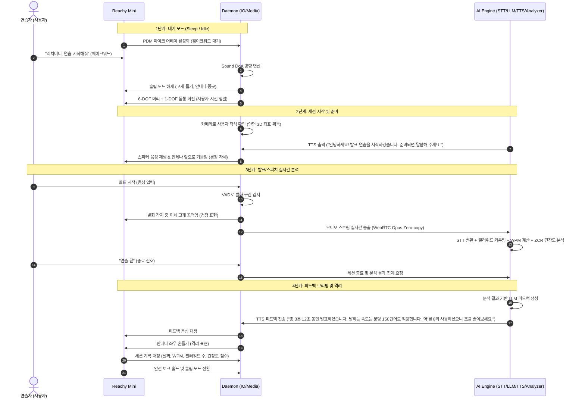

# Reachy Mini 시나리오 정의서: 발표/면접 연습 코치 (Speech & Interview Practice Coach)

본 문서는 Reachy Mini의 하드웨어 특성(9 DOF 기구, 스튜어트 플랫폼, 마이크 어레이, 카메라 등)과 실시간 음성 분석 및 AI 피드백 기능을 결합하여, 사용자가 혼자서도 발표·면접 연습을 효과적으로 수행할 수 있도록 지원하는 스피치 코치 시나리오 정의서입니다.

---

## 1. 시나리오 개요
* **시나리오명**: AI 기반 실시간 스피치 피드백 연습 코치
* **적용 분야**: 개인 방, 서재, 발표 준비실, 취업 준비 공간
* **핵심 목표**: 사용자가 발표하거나 면접 연습을 할 때 Reachy Mini가 시선을 맞추며 경청하고, 발화 중 실시간으로 말하는 속도(WPM), 필러워드("어", "음") 빈도, 음성 떨림 등을 분석한 뒤, 연습이 끝나면 TTS로 구체적인 개선 피드백을 전달합니다. 안테나와 head 모션으로 격려 및 집중 상태를 시각적으로 표현합니다.

---

## 2. 시나리오 구현을 위한 필수 기술 체크리스트

본 시나리오의 완벽한 작동(인식, 제어, 미디어 통신, 안전)을 지원하기 위해 개발 및 검증되어야 할 기술 요소들입니다.

### 2.1. 인지 및 감지 기술 (Perception & Detection)
- [ ] **사용자 안면 인식 및 3D 좌표화 (Face Detection & Mapping)**
  - 12MP CSI 카메라 비전 스트림에서 실시간 사용자 얼굴 랜드마크 추출 및 타겟 좌표(3D 공간상의 위치) 연산.
- [ ] **음원 방향 추적 (Sound DoA - Direction of Arrival)**
  - reSpeaker XMOS XVF3800 마이크 어레이 채널 간 신호 도달 시간차(TDoA) 분석을 통한 화자 수평 각도 추출.
- [ ] **실시간 발화 분석 (Speech Feature Extraction)**
  - VAD(Voice Activity Detection)로 발화 구간 분리.
  - ZCR(Zero Crossing Rate) 및 에너지 분석으로 음성 떨림·긴장도 측정.
  - FFT 기반 주파수 분석으로 음성 레벨 모니터링.
  - 필러워드("어", "음", "그", "저") STT 후 카운팅 및 WPM(Words Per Minute) 계산.

### 2.2. 기구 제어 및 모션 기술 (Kinematics & Motion Control)
- [ ] **타겟 추적 시선 제어 (Look-at & Tracking Control)**
  - 인지된 사용자 3D 좌표를 바탕으로 머리가 부드럽게 화자를 응시하도록 매끄러운 궤적(Trajectory) 생성 제어.
- [ ] **스튜어트 플랫폼 6자유도 기구학 (6-DOF Kinematics Engine)**
  - 역기구학(IK) 해석해(Analytical Solution) 및 순기구학(FK) 수치해석(Newton-Raphson) 구현.
  - Rust 가속화 패키지(`reachy_mini_rust_kinematics`) 연동 검증.
- [ ] **감정 표현 안테나 제어 (2-DOF Antenna Emotion Motion)**
  - 경청 상태(안테나 앞으로 기울임), 피드백 전달(빠른 진동), 격려(좌우 흔들기) 등 상황별 독립 궤적 제어.
- [ ] **발화 감지 동기 head 반응 (Speech-sync Head Nodding)**
  - 사용자 발화가 감지되는 동안 미세한 고개 끄덕임으로 경청하고 있음을 표현.

### 2.3. 대화형 AI 및 외부 연동 기술 (Interactive AI & Integration)
- [ ] **실시간 음성 처리 파이프라인 (Speech Pipeline)**
  - VAD 필터링 → STT(음성인식) → 필러워드/WPM 집계 → LLM(피드백 생성) → TTS(음성합성) 모델의 저지연 파이프라인 통합.
- [ ] **피드백 생성 LLM 연동 (Feedback LLM Integration)**
  - 발화 분석 결과(필러워드 수, WPM, 긴장도 점수)를 프롬프트로 구성하여 LLM에 전달, 구체적 개선 제안 생성.
- [ ] **세션 기록 및 이력 관리 (Session History)**
  - 연습 회차별 분석 결과(날짜, WPM, 필러워드 수, 긴장도)를 로컬에 저장하여 성장 추이 추적.

### 2.4. 미디어 및 통신 기술 (Media & Communication)
- [ ] **초저지연 양방향 통신 백엔드 (WebRTC & GStreamer)**
  - GStreamer 파이프라인 표준화를 통한 실시간 음성 전달.
  - 버퍼 복사 제거(Zero-copy) 및 Opus 오디오 코덱 최적화를 통한 오디오 딜레이 최소화.

### 2.5. 하드웨어 보호 및 안전 기술 (Safety & Fallback)
- [ ] **낙하 방지 안전 토크 제어 (Safety Torque Hold)**
  - 프로세스 비정상 종료, Wi-Fi 단절 시 즉시 `enable_torque`를 강제 적용하여 자중에 의한 기구부 파손 방지.
- [ ] **장시간 사용 과열 감지 (Overheat & Idle Protection)**
  - 연습 세션이 비정상적으로 길어질 경우(30분 이상 미종료) 경고 음성 출력 후 슬립 모드 전환.

---

## 3. 시나리오 시퀀스 흐름 (Mermaid)

---

## 4. 하드웨어 및 소프트웨어 매핑

이 시나리오에 구동되는 Reachy Mini의 내장 리소스 및 모듈 연동 현황입니다.

| 구분 | 사용 리소스 | 역할 및 동작 상세 | 관련 소스 코드 예시 |
| :--- | :--- | :--- | :--- |
| **입력 (감지)** | **reSpeaker XVF3800** 마이크 어레이 | 빔포밍 및 음원 방향 추적(DoA)으로 화자 위치 파악. VAD·ZCR·FFT 기반 발화 분석 | `examples/sound_doa.py` |
| | **Sony IMX708 CSI** 카메라 | 사용자 얼굴 랜드마크 추출 및 3D 좌표 연산으로 시선 추적 | `src/reachy_mini/media/camera_gstreamer.py` |
| **제어 (동작)** | **XL330-M288-T** (6ea) | 스튜어트 플랫폼 구동. 경청 중 고개 끄덕임, 피드백 전달 시 고개 기울임 등 표현 | `src/reachy_mini/kinematics/` |
| | **XL330-M077-T** (2ea) | 좌/우 안테나. '경청'(앞으로 기울임), '격려'(좌우 흔들기), '피드백 전달'(빠른 진동) 등 | `src/reachy_mini/io/` |
| | **XC330-M288-PG** (1ea) | 몸통 Base 회전. 사용자가 위치를 바꾸더라도 시선 일치 유지 | `src/reachy_mini/kinematics/` |
| **통신/미디어** | **WebRTC + GStreamer** | 저지연 음성 전송으로 실시간 발화 분석 및 피드백 음성 출력 | `src/reachy_mini/media/` |
| **AI 분석 엔진** | **FastAPI Daemon + LLM API** | STT 변환, 필러워드/WPM/긴장도 집계, LLM 기반 맞춤 피드백 생성 | `src/reachy_mini/daemon/` |

---

## 5. 상세 시나리오 동작 프로세스

### 단계 1: 슬립 모드 및 대기 (Sleep / Idle)
* **로봇 상태**: 고개를 숙이고 안테나를 완전히 눕혀 수면 중인 상태 연출. 최소 대기 전력 모드 가동.
* **센서 상태**: 마이크 어레이에서 웨이크워드("리치미니", "연습 시작") 또는 특정 소음 패턴 감지 대기.

### 단계 2: 세션 시작 및 준비 (Wake-up & Session Init)
* **도입 트리거**: 웨이크워드 감지 또는 카메라 비전 상으로 사용자 착석이 감지될 때.
* **동작**:
  1. 머리를 천천히 들고 안테나를 쫑긋 세워 준비 완료를 표현합니다.
  2. 사용자 얼굴 방향을 트래킹(`look_at`)하여 눈을 마주칩니다.
  3. 스피커로 세션 시작 안내 멘트를 출력하고, 안테나를 앞으로 기울여 경청 자세에 들어갑니다.

### 단계 3: 발표/스피치 실시간 분석 (Real-time Speech Analysis)
* **동작**:
  1. **발화 구간 감지**: VAD가 발화 시작을 감지하면 분석 세션을 시작합니다.
  2. **시선 고정 유지**: `look_at`으로 사용자를 계속 바라보며, 발화 중 미세 고개 끄덕임으로 경청을 표현합니다.
  3. **실시간 지표 집계**:
     - **WPM**: STT 결과의 단어 수를 발화 시간으로 나눠 말하기 속도를 측정합니다.
     - **필러워드**: "어", "음", "그", "저" 등 불필요한 반복어를 감지·카운팅합니다.
     - **긴장도**: ZCR 및 에너지 분산으로 음성 떨림을 수치화합니다.
  4. **중간 피드백**: 필러워드가 일정 횟수 이상 반복되면 안테나를 살짝 흔들어 비언어적 신호를 줍니다.
  5. **종료 감지**: "연습 끝", "그만" 등 종료 발화를 STT로 인식하면 분석을 마무리합니다.

### 단계 4: 피드백 브리핑 및 종료 (Feedback & Sleep)
* **동작**:
  1. 분석 결과를 LLM에 전달하여 구체적이고 개선 가능한 피드백 문장을 생성합니다.
  2. TTS로 피드백을 음성 출력합니다. ("총 발표 시간, WPM, 필러워드 사용 빈도, 긴장도 점수, 개선 포인트" 순서로 안내)
  3. 피드백 완료 후 안테나를 좌우로 흔들며 격려를 표현합니다.
  4. 세션 결과(날짜, WPM, 필러워드 수, 긴장도 점수)를 로컬 파일에 기록합니다.
  5. **안전 토크 홀드(Safety Torque Hold)** 를 적용하고 슬립 모드로 전환합니다.

---

## 6. 예외 상황 처리 및 안전 장치 (Exception Handling)

> [!IMPORTANT]
> **스피치 코치 시나리오 맞춤 안전 로직**
> 1. **무음 지속 시 자동 일시정지**: 발화 없이 2분 이상 VAD 감지가 없으면 "계속 진행하시겠어요?"라고 물어본 뒤, 응답이 없으면 세션을 저장하고 슬립 모드로 전환합니다.
> 2. **세션 과장 방지**: 연습 세션이 30분을 초과하면 중간 휴식을 권유하는 TTS를 출력하고 잠시 대기합니다.
> 3. **STT 오인식 방지**: "연습 끝"과 유사한 발화를 중간에 인식하더라도, 3초 이내 "취소"라고 말하면 세션을 계속 유지하는 Undo 구간을 제공합니다.
> 4. **충돌 감지 및 토크 해제**: 사용자가 로봇과 접촉할 때 이상 저항이 감지되면 즉시 토크를 해제(Torque Off)하고 안전 자세로 복귀합니다.
