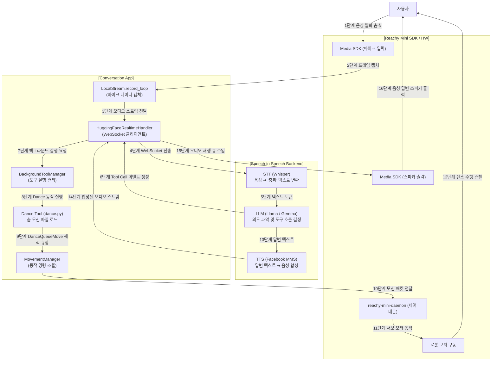

```mermaid

graph TD
    %% 1단계: 사용자 인터랙션 시작
    User["사용자"]

    %% Conversation App 영역
    subgraph App["[Conversation App]"]
        RecLoop["LocalStream.record_loop<br/>(마이크 데이터 캡처)"]
        Handler["HuggingFaceRealtimeHandler<br/>(WebSocket 클라이언트)"]
        BTM["BackgroundToolManager<br/>(도구 실행 관리)"]
        DanceTool["Dance Tool (dance.py)<br/>춤 모션 파일 로드"]
        MoveMgr["MovementManager<br/>(동작 명령 조율)"]
    end

    %% S2S Backend 영역
    subgraph S2S["[Speech to Speech Backend]"]
        STT["STT (Whisper)<br/>음성 ➔ '춤춰' 텍스트 변환"]
        LLM["LLM (Llama / Gemma)<br/>의도 파악 및 도구 호출 결정"]
        TTS["TTS (Facebook MMS)<br/>답변 텍스트 ➔ 음성 합성"]
    end

    %% Reachy Mini SDK 영역
    subgraph SDK["[Reachy Mini SDK / HW]"]
        Mic["Media SDK (마이크 입력)"]
        Daemon["reachy-mini-daemon (제어 데몬)"]
        Motor["로봇 모터 구동"]
        Spk["Media SDK (스피커 출력)"]
    end

    %% 흐름 연결 (리스트 형태 오인을 막기 위해 온점 제외)
    User -->|1단계 음성 발화 춤춰| Mic
    Mic -->|2단계 프레임 캡처| RecLoop
    RecLoop -->|3단계 오디오 스트림 전달| Handler
    Handler -->|4단계 WebSocket 전송| STT
    STT -->|5단계 텍스트 토큰| LLM
    LLM -->|6단계 Tool Call 이벤트 생성| Handler
    Handler -->|7단계 백그라운드 실행 요청| BTM
    BTM -->|8단계 Dance 동작 실행| DanceTool
    DanceTool -->|9단계 DanceQueueMove 궤적 큐잉| MoveMgr
    MoveMgr -->|10단계 모션 패킷 전달| Daemon
    Daemon -->|11단계 서보 모터 동작| Motor
    Motor -->|12단계 댄스 수행 관찰| User

    %% TTS 응답 흐름 추가
    LLM -->|13단계 답변 텍스트| TTS
    TTS -->|14단계 합성된 오디오 스트림| Handler
    Handler -->|15단계 오디오 재생 큐 주입| Spk
    Spk -->|16단계 음성 답변 스피커 출력| User
```
