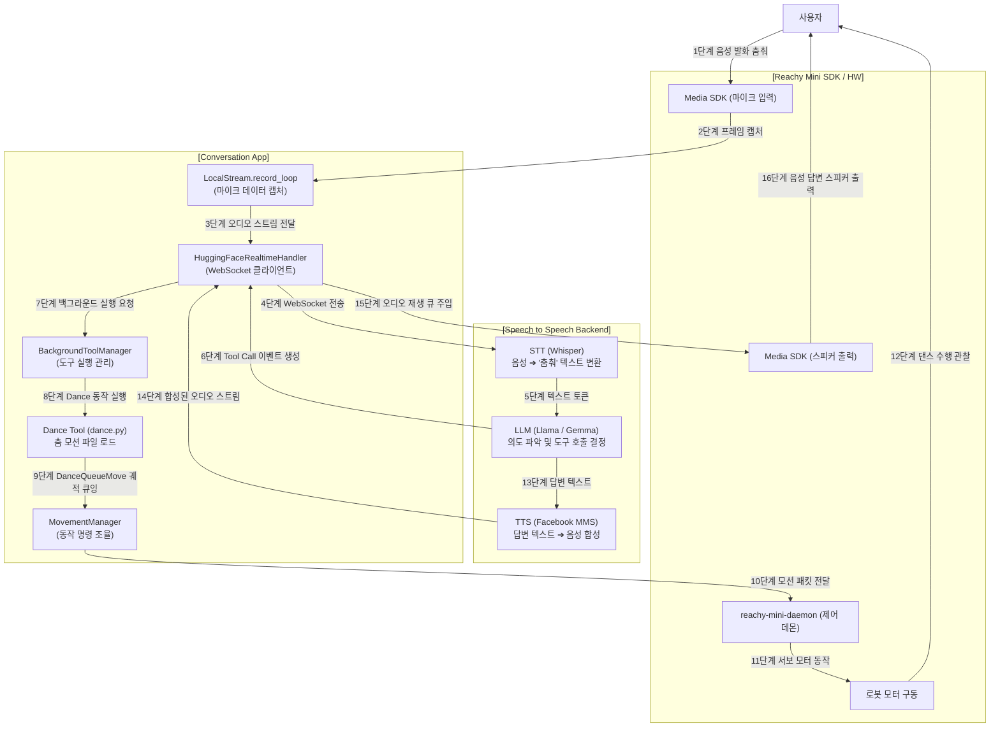

### 💻 로컬 구동 vs ☁️ 원격/배포 구동 비교

| 구분 | 💻 로컬 구동 (Local Mode) | ☁️ 원격/배포 구동 (Deployed Mode) |
| :--- | :--- | :--- |
| **PC 역할** | **서버**와 **클라이언트** 역할을 모두 수행 | 오직 **클라이언트** 역할만 수행 |
| **백엔드 서버 위치** | 질문자님의 로컬 PC (Ollama, Whisper 등 구동) | 외부 Hugging Face 클라우드 서버 |
| **실행할 명령어** | 1. **(백엔드)** `speech-to-speech ...` CLI 실행<br/>2. **(앱)** `reachy-mini-conversation-app` 실행 | 1. **(백엔드)** 실행 필요 없음 (이미 배포됨)<br/>2. **(앱)** `reachy-mini-conversation-app`만 실행 |
| **PC 권장 사양** | 딥러닝 구동을 위한 고사양 GPU 필요 | 기본 CPU 환경에서도 가볍게 실행 가능 |
| **네트워크 상태** | 인터넷이 끊겨도 로컬에서 작동 가능 | 외부 클라우드 접속을 위해 인터넷 연결 필수 |

---
## **S2S WebSocket 서버를 구동**
### 1. 실행하실 방법 (Kokoro 구동)
1. **백엔드 서버 터미널**에서 다시 `kokoro` 옵션으로 서버를 켭니다:
   ```powershell
   speech-to-speech --llm_backend responses-api --responses_api_base_url http://localhost:11434/v1 --model_name gemma4:cloud --responses_api_api_key dummy --device cpu --tts kokoro
   ```
kokoro 한국어 미지원 따라서 다음과 같이 수정

### 2. 1번 옵션이 반응을 안 해 다른 옵션 선택
speech-to-speech --llm_backend responses-api --responses_api_base_url http://localhost:11434/v1 --model_name gemma4:cloud --responses_api_api_key dummy --device cpu --stt whisper --stt_model_name openai/whisper-base --stt_torch_dtype float32 --language ko --tts facebookMMS --tts_language ko

로컬에서 **실시간 S2S WebSocket 서버를 구동(호스팅)하는 명령**.

`speech-to-speech` 패키지가 올바르게 가상환경에 설치(`pip install -e .`)되면 터미널에서 `speech-to-speech`라는 CLI 명령어를 직접 사용할 수 있게 등록됩니다.

### 🔍 실행 명령어 구성 분석

```bash
speech-to-speech \
  --llm_backend responses-api \
  --responses_api_base_url http://localhost:11434/v1 \
  --model_name gemma4:cloud \
  --responses_api_api_key dummy \
  --device cpu \
  --stt whisper \
  --stt_model_name openai/whisper-base \
  --stt_torch_dtype float32 \
  --language ko \
  --tts facebookMMS \
  --tts_language ko
```

* **`--llm_backend responses-api`**: LLM 엔진으로 OpenAI와 호환되는 API 서버(이 경우 로컬 Ollama 등)를 사용하겠다고 지정합니다.
* **`--responses_api_base_url http://localhost:11434/v1`**: Ollama가 로컬 컴퓨터(`localhost:11434`)에서 대기 중인 주소를 설정합니다.
* **`--model_name gemma4:cloud`**: Ollama에 등록된 모델 중 `gemma4:cloud` 모델을 대화 엔진으로 지정합니다.
* **`--device cpu`**: 그래픽 카드(GPU) 대신 **CPU를 사용**하여 로컬에서 STT/TTS 모델 연산을 처리합니다.
* **`--stt whisper --stt_model_name openai/whisper-base`**: 로컬에서 `openai/whisper-base` 모델을 돌려 실시간 음성 인식을 수행합니다.
* **`--stt_torch_dtype float32`**: CPU 실행을 위해 데이터 타입을 `float32`로 지정합니다.
* **`--language ko`**: 대화 언어를 **한국어**로 지정합니다.
* **`--tts facebookMMS --tts_language ko`**: 답변 음성 합성으로 Facebook MMS 한국어 모델을 로컬에서 작동시킵니다.

### 3. 실행 결과 및 연동
이 명령어를 실행하면, 기본적으로 **`ws://localhost:8765`** 주소로 WebSocket 서버가 개설되어 클라이언트의 실시간 음성 스트림 접속을 대기하게 됩니다.

이후 Reachy Mini App의 `.env` 환경 변수를 다음과 같이 연동하여 작동시킵니다.
```env
HF_REALTIME_CONNECTION_MODE=local
HF_REALTIME_WS_URL=ws://localhost:8765/v1/realtime
```



