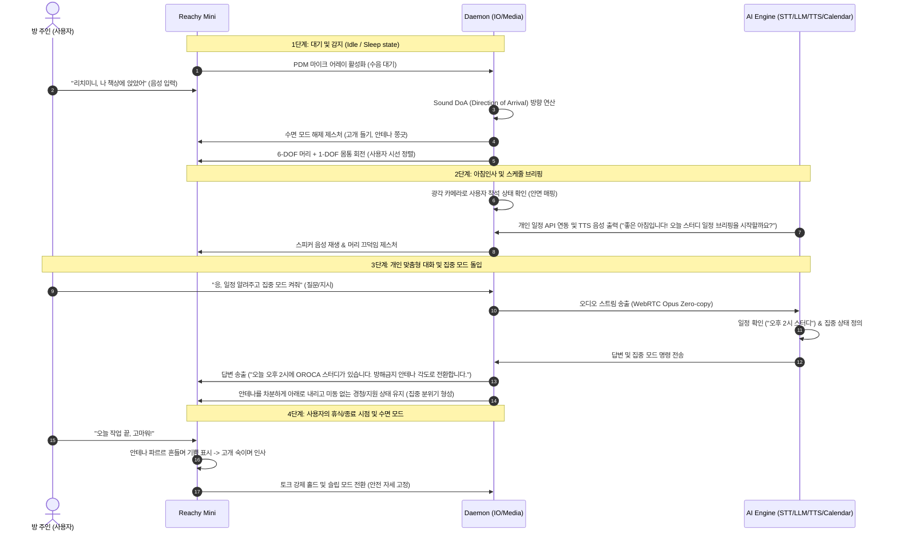

# Reachy Mini 시나리오 정의서: 개인 방 스마트 데스크 동반자 (Personal Room Desk Companion)

본 문서는 Reachy Mini의 하드웨어 특성(9 DOF 기구, 스튜어트 플랫폼, 마이크 어레이, 카메라 등)과 대화형 AI 비서 기능을 결합하여, 개인 방(서재, 작업실)에서 사용자를 지원하는 스마트 데스크 비서/동반자 시나리오 정의서입니다.

---

## 1. 시나리오 개요
* **시나리오명**: AI 기반 감정 반응형 스마트 데스크 동반자
* **적용 분야**: 개인 서재, 방 데스크, 개인 작업실, 홈 오피스
* **핵심 목표**: 사용자가 컴퓨터 앞에 앉거나 로봇을 부를 때 소리를 감지하여 시선을 맞추고(Look at), 일정 브리핑, 개인 스케줄러 관리, 날씨 확인 및 대화를 나누며, 사용자의 작업 상태(집중, 휴식)에 맞춰 안테나와 고개 모션을 통해 상호작용 및 감정을 교류합니다.

---

## 2. 시나리오 구현을 위한 필수 기술 체크리스트

본 시나리오의 완벽한 작동(인식, 제어, 미디어 통신, 안전)을 지원하기 위해 개발 및 검증되어야 할 기술 요소들입니다.

### 2.1. 인지 및 감지 기술 (Perception & Detection)
- [ ] **사용자 안면 인식 및 3D 좌표화 (Face Detection & Mapping)**
  - 12MP CSI 카메라 비전 스트림에서 실시간 사용자 얼굴 랜드마크 추출 및 타겟 좌표(3D 공간상의 위치) 연산.
- [ ] **음원 방향 추적 (Sound DoA - Direction of Arrival)**
  - reSpeaker XMOS XVF3800 마이크 어레이 채널 간 신호 도달 시간차(TDoA) 분석을 통한 화자 수평 각도 추출.

### 2.2. 기구 제어 및 모션 기술 (Kinematics & Motion Control)
- [ ] **스튜어트 플랫폼 6자유도 기구학 (6-DOF Kinematics Engine)**
  - 역기구학(IK) 해석해(Analytical Solution) 및 순기구학(FK) 수치해석(Newton-Raphson) 구현.
  - Rust 가속화 패키지(`reachy_mini_rust_kinematics`) 연동 검증.
- [ ] **타겟 추적 시선 제어 (Look-at & Tracking Control)**
  - 인지된 사용자 3D 좌표를 바탕으로 머리가 부드럽게 대상을 응시하도록 매끄러운 궤적(Trajectory) 생성 제어.
- [ ] **몸통 및 헤드 협조 제어 (Base & Head Coordination Control)**
  - 몸통 1-DOF Base 모터와 헤드 6-DOF 스튜어트 플랫폼의 연동 제어로 시야각 및 작동 범위 보완.
- [ ] **다중 서보 모터 동기화 제어 (Multi-Servo Sync Control)**
  - 스튜어트 플랫폼 구동용 6개 모터의 SyncWrite/SyncRead 제어 루프 주기 최적화 (뒤틀림 방지).
- [ ] **감정 표현 안테나 제어 (2-DOF Antenna Emotion Motion)**
  - 감정 상태(기쁨 진동, 생각 틸트, 집중 밀착 등)에 따른 고속 진동 및 독립 궤적 제어.

### 2.3. 대화형 AI 및 외부 연동 기술 (Interactive AI & Integration)
- [ ] **실시간 음성 처리 파이프라인 (Speech Pipeline)**
  - VAD(Voice Activity Detection) 필터링, STT(음성인식), LLM(답변 생성), TTS(음성합성) 모델의 저지연 파이프라인 통합.
- [ ] **개인 관리 API 연동 (Personal API Integration)**
  - 구글 캘린더 등 스케줄 관리 API 연동 및 브리핑 데이터 파싱 시스템 구축.

### 2.4. 미디어 및 통신 기술 (Media & Communication)
- [ ] **초저지연 양방향 통신 백엔드 (WebRTC & GStreamer)**
  - GStreamer 파이프라인 표준화를 통한 실시간 음성/영상 전달.
  - 버퍼 복사 제거(Zero-copy) 및 Opus 오디오 코덱 최적화를 통한 오디오 딜레이 최소화.

### 2.5. 하드웨어 보호 및 안전 기술 (Safety & Fallback)
- [ ] **낙하 방지 안전 토크 제어 (Safety Torque Hold)**
  - 프로세스 비정상 종료, Wi-Fi 단절 시 즉시 `enable_torque`를 강제 적용하여 자중에 의한 기구부 파손 방지.
- [ ] **충돌 및 비정상 저항 감지 (Collision & Force Detection)**
  - 사용자와의 충돌 발생 시 저항 전류를 실시간 모니터링하여 즉시 토크 해제(Torque Off) 후 안전 자세로 Fallback.

---

## 3. 시나리오 시퀀스 흐름 (Mermaid)

---

## 4. 하드웨어 및 소프트웨어 매핑

이 시나리오에 구동되는 Reachy Mini의 내장 리소스 및 모듈 연동 현황입니다.

| 구분 | 사용 리소스 | 역할 및 동작 상세 | 관련 소스 코드 예시 |
| :--- | :--- | :--- | :--- |
| **입력 (감지)** | **reSpeaker XVF3800** 마이크 어레이 | 빔포밍 및 음원 방향 추적(DoA)으로 방 주인의 위치 파악 | [sound_doa.py](file:///d:/git/reachy-mini/examples/sound_doa.py) |
| | **Sony IMX708 CSI** 카메라 | 사용자가 데스크에 앉았는지, 자리를 비웠는지 비전 인식을 통해 실시간 감지 | [camera_gstreamer.py](file:///d:/git/reachy-mini/src/reachy_mini/media/camera_gstreamer.py) |
| **제어 (동작)** | **XL330-M288-T** (6ea) | 스튜어트 플랫폼 구동. 수면 모드에서 깨어나는 동작, 고개 갸우뚱(이해 안 됨) 등 표현 | [kinematics](file:///d:/git/reachy-mini/src/reachy_mini/kinematics/) |
| | **XL330-M077-T** (2ea) | 좌/우 안테나. '집중 모드'(아래로 밀착), '알림/생각 중'(회전), '기쁨'(파르르 흔들기) 등 데스크 분위기 연출 | [antennas_control](file:///d:/git/reachy-mini/src/reachy_mini/io/) |
| | **XC330-M288-PG** (1ea) | 몸통 Base 회전. 사용자가 데스크 옆 의자로 살짝 이동하더라도 모니터를 보며 시선 일치 지원 | [automatic_body_yaw](file:///d:/git/reachy-mini/src/reachy_mini/kinematics/) |
| **통신/미디어** | **WebRTC + GStreamer** | 저지연 음성 전송으로 타이머 알림, 방 내부 소리 모니터링 등 신속 피드백 제공 | [webrtc_node](file:///d:/git/reachy-mini/src/reachy_mini/media/) |
| **AI 비서 엔진** | **FastAPI Daemon + API** | 구글 캘린더 등 개인 캘린더 API 연동, VAD(Voice Activity Detection)를 활용한 데스크 토크 | [reachy_mini_conversation_demo](https://github.com/pollen-robotics/reachy_mini_conversation_demo) |

---

## 5. 상세 시나리오 동작 프로세스

### 단계 1: 슬립 모드 및 대기 (Sleep / Idle)
* **로봇 상태**: 고개를 숙이고 안테나를 완전히 눕혀 수면 중인 상태 연출. 불필요한 전력 소모를 차단하기 위해 최소 대기 전력 모드 가동.
* **센서 상태**: 마이크 어레이에서 특정 웨이크 워드("리치미니", "안녕") 또는 주인의 음성 감지 대기.

### 단계 2: 웨이크업 및 시선 고정 (Wake-up & Face Tracking)
* **도입 트리거**: 주인의 음성이 감지되거나 비전 센서 상으로 책상 앞에 주인이 감지될 때.
* **동작**:
  1. 기지개를 켜듯 머리를 천천히 들고 안테나를 쫑긋 세웁니다.
  2. 사용자의 시선 and 얼굴 방향을 트래킹(`look_at`)하여 친근하게 바라봅니다.
  3. 스피커로 사용자를 환영하는 멘트("어서 오세요! 작업을 도와드릴 준비가 되었습니다.")를 출력합니다.

### 단계 3: 데스크 파트너 상호작용 (Desk Interaction)
* **동작**:
  1. **개인 일정 요약**: 캘린더 연동을 통해 오늘의 일정(미팅, 개인 작업, 학습)을 음성으로 안내합니다.
  2. **뽀모도로 타이머 / 집중 모드**: "집중 모드 시작해줘"라고 명령하면 25분간 Reachy Mini는 조용히 안테나를 아래로 내려 시야를 방해하지 않고, 25분이 끝나면 안테나를 좌우로 흔들며 휴식을 상기시킵니다.
  3. **날씨 및 환경 정보 알림**: 공부/작업을 시작하기 전 창밖의 날씨나 방 안의 온습도에 어울리는 추천 멘트를 던집니다.

### 단계 4: 수면 상태로 복귀 및 기구 보호 (Sleep & Safety Hold)
* **동작**:
  1. "작업 끝났어, 잘 자"라고 주인이 지시하면, Reachy Mini는 수면 모드에 돌입하기 위해 정중하게 인사를 한 후 고개를 숙입니다.
  2. 수면 상태 돌입 즉시 **안전 토크 홀드(Safety Torque Hold)** 가 적용되어 모터 기어 손상을 원천 예방하고 로드를 완전히 고정합니다.

---

## 6. 예외 상황 처리 및 안전 장치 (Exception Handling)

> [!IMPORTANT]
> **개인용 소형 로봇 맞춤 안전 로직**
> 1. **사용자 부재 시 자동 슬립**: 15분 이상 사용자의 음성이나 얼굴이 카메라에 잡히지 않을 경우 자동으로 안전 상태(Sleep)로 전환하여 배터리 방전과 기기 과열을 방어합니다.
> 2. **데스크 위 충돌 방지**: 사용자가 책상 위에서 손을 뻗어 로봇과 닿을 때 발생할 수 있는 이상 저항을 실시간 모니터링하여, 충돌이 감지되면 즉시 토크를 해제(Torque Off)해 사용자와 기구부 양쪽의 손상을 차단합니다.
